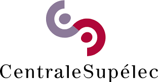

<div id="toc">
  <ul align="center" style="list-style: none">

# OpenGateLLM

[](https://github.com/etalab-ia/albert-api/releases) 
[](https://github.com/etalab-ia/albert-api)
[](https://github.com/etalab-ia/albert-api/blob/main/LICENSE)
[](./docs/README_fr.md)

### *✨ Serve all your self-hosted models in one place and manage your users ✨*

[**API Reference**](https://albert.api.etalab.gouv.fr/documentation) | [**Swagger**](https://albert.api.etalab.gouv.fr/swagger)

  </ul>
</div>

## 🔥 Why OpenGateLLM?

- 🌐 **OpenAI standards**: based on OpenAI API conventions. Easy to use with OpenAI SDKs, LangChain, LlamaIndex, etc.
- 🚦 **Robust API Gateway:** Load balancing, authentication, and seamless integration with OpenAI, vLLM, HuggingFace TEI.
- 📖 **Open Source**: developed by the French Government, fully open-source forever.
- ⚙️ **Production-ready**: ready to serve your models in production.
- 📚 **Full stack genAI API:** Built-in Retrieval-Augmented Generation (RAG), OCR, audio transcription, and more.
- ✍️ **High code standards**

## 🎯 Key Features

### API Gateway: supported providers

| Provider | Supported endpoints |
| -------- | ------------------- |
| Albert API (French Public Administration)   | Language, Embeddings, Reranking, Transcription |
| OpenAI   | Language, Embeddings, Reranking, Transcription |
| vLLM     | Language |
| HuggingFace TEI | Embeddings, Reranking |

### Advanced AI Capabilities

* **RAG Integration:** Efficiently query vector databases using Elasticsearch or Qdrant.
* **Audio & Vision:** Transcribe audio (Whisper) and perform OCR on PDF documents.
* **Enhanced Security:** Built-in API key authentication.

## 📊 Comparison

| Feature              | OpenGateLLM ✅ | LiteLLM   | OpenRouter | OpenAI API |
| -------------------- | ------------ | --------- | ---------- | ---------- |
| Fully Open Source    | ✔️ | ❌ | ❌ | ❌ |
| Data Sovereignty     | ✔️ | ✔️ | ❌ | ❌ |
| Multiple AI Backends | ✔️ | ✔️ | ✔️ | ❌ |
| Built-in RAG         | ✔️ | ❌ | ❌ | ❌ |
| Built-in OCR         | ✔️ | ❌ | ❌ | ❌ |
| Audio Transcription  | ✔️ | ❌ | ❌ | ❌ |
| Flexible Deployment  | ✔️ | ✔️ | ❌ | ❌ |
| OpenAI Compatibility | ✔️ | ✔️ | ✔️ | ❌ |

## 📘 Tutorials & Guides

Explore practical use cases:

* [**Chat Completions**](https://colab.research.google.com/github/etalab-ia/albert-api/blob/main/docs/tutorials/chat_completions.ipynb)
* [**Multi-Model Access**](https://colab.research.google.com/github/etalab-ia/albert-api/blob/main/docs/tutorials/models.ipynb)
* [**Retrieval-Augmented Generation (RAG)**](https://colab.research.google.com/github/etalab-ia/albert-api/blob/main/docs/tutorials/retrieval_augmented_generation.ipynb)
* [**Knowledge Database Import**](https://colab.research.google.com/github/etalab-ia/albert-api/blob/main/docs/tutorials/import_knowledge_database.ipynb)
* [**Audio Transcriptions**](https://colab.research.google.com/github/etalab-ia/albert-api/blob/main/docs/tutorials/audio_transcriptions.ipynb)
* [**PDF OCR**](https://colab.research.google.com/github/etalab-ia/albert-api/blob/main/docs/tutorials/pdf_ocr.ipynb)

## 🚀 Quickstart

Deploy OpenGateLLM quickly with Docker connected to own free model and start using it:

```bash
make quickstart
```
Test the API:

```bash 
curl -X POST "http://localhost:8080/v1/chat/completions" \
-H "Content-Type: application/json" \
-H "Authorization: Bearer changeme" \
-d '{"model": "albert-testbed", "messages": [{"role": "user", "content": "Hello, how are you?"}]}'
```
The default master API key is `changeme`.

### User interface

A user interface is available at: http://localhost:8081/playground

User: master
Password: changeme

### Create a first user

```bash
make create-user
```

### Configure your models and add features

With configuration file, you can connect to your own models and add addtionnal services to OpenGateLLM. 
Start by creating a configuration file and a .env dedicated:

```bash
cp config.example.yml config.yml && export CONFIG_FILE=./config.yml
cp .env.example .env && export APP_ENV_FILE=.env
```

Check the [configuration documentation](./docs/configuration.md) to configure your configuration file.

Vou can then set your environment variables in .env according to your needs.

You can run the services you need by running:
```bash
docker compose --env-file .env up <services_you_need> --detach 
```

For instance:
```bash
docker compose --env-file .env up api playground postgres redis elasticsearch secretiveshell --detach 
```


## 🤝 Contribute

This project exists thanks to all the people who contribute. OpenGateLLM thrives on open-source contributions. Join our community!

* [Contribution Guide](./CONTRIBUTING.md)

## Sponsors

<div id="toc">
  <ul align="center" style="list-style: none">
<a href="https://www.numerique.gouv.fr/numerique-etat/dinum/" ></a>
<a href="https://www.centralesupelec.fr"></a>
  </ul>
</div>
