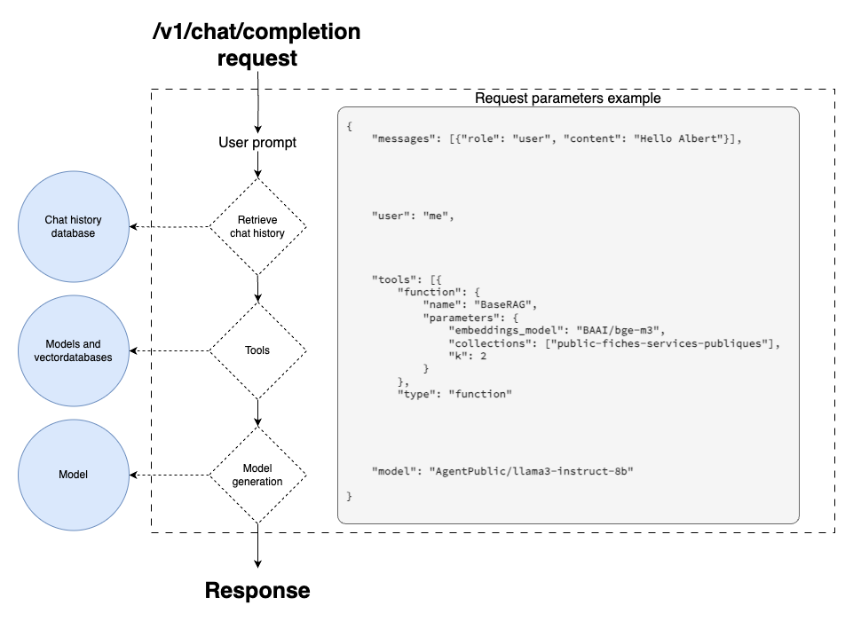

# Albert API

## Fonctionnalités

### OpenAI conventions

En ce base sur le [client officiel python d'OpenAI](https://github.com/openai/openai-python/tree/main), Albert API expose des endpoints respectant les conventions définies par OpenAI : 

- `/v1/models`
- `/v1/completions`
- `/v1/chat/completions`
- `/v1/embeddings`

Ce formalisme permet d'intégrer facilement l'API Albert avec des librairies tierces comme [Langchain](https://www.langchain.com/) ou [LlamaIndex](https://www.llamaindex.ai/).

### Converser avec un modèle de langage (chat memory)

Albert API intègre nativement la mémorisation des messages pour les conversations sans surcharger d'arguments le endpoint `/v1/chat/completions` par rapport à la documentation d'OpenAI. Cela consiste à envoyer à chaque requête au modèle l'historique de la conversation pour lui fournir le contexte.

> 📖 [Notebook de démonstration](./tutorials/chat_completions.ipynb)

### Accéder à plusieurs modèles de langage (multi models)

Grâce à un fichier de configuration (*[config.example.yml](./config.example.yml)*) vous pouvez connecter autant d'API de modèles que vous le souhaitez. L'API Albert se charge de mutualiser l'accès à tous ces modèles dans une unique API. Vous pouvez constater les différents modèles accessibles en appelant le endpoint `/v1/models`.

> 📖 [Notebook de démonstration](./tutorials/models.ipynb)

### Fonctionnalités avancées (tools) 

Les tools sont une fonctionnalité définie OpenAI que l'on surcharge dans le cas de l'API Albert pour permettre de configurer des tâches spéficiques comme du RAG ou le résumé. Vous pouvez appelez le endpoint `/tools` pour voir la liste des tools disponibles.



#### Interroger des documents (RAG)

> 📖 [Notebook de démonstration](./tutorials/retrival_augmented_generation.ipynb)

#### Résumer un document (summarize)

> 📖 [Notebook de démonstration](./tutorials/summarize.ipynb)

## Déployer l'API Albert

### Quickstart

1. Installez [libmagic](https://man7.org/linux/man-pages/man3/libmagic.3.html)

2. Installez les packages Python

  ```bash 
  cd app
  pip install .
  ```

3. Créez un fichier *config.yml* à la racine du repository sur la base du fichier d'exemple *[config.example.yml](./config.example.yml)*

  Si vous souhaitez configurer les accès aux modèles et aux bases de données, consultez la [Configuration](#configuration).

  Pour lancer l'API : 
  ```bash
  uvicorn app.main:app --reload --port 8080 --log-level debug
  ```

### Configuration

Toute la configuration de l'API Albert se fait dans fichier de configuration qui doit respecter les  spécifications suivantes (voir *[config.example.yml](./config.example.yml)* pour un exemple) :

```yaml
auth: [optional]
  type: [optional]
  args: [optional] 
    [arg_name]: [value]
    ...
  
models:
    - url: [required]
      key: [optional]
    ...

databases:
  cache: [required]
    type: [required] # see following Database section for the list of supported db type
    args: [required] 
      [arg_name]: [value]
      ...
    
  vectors: [required]
    type: [required] # see following Database section for the list of supported db type
    args: [required] 
      [arg_name]: [value]
      ...
  
  files: [required]
    type: [required] # see following Database section for the list of supported db type
    args: [required] 
      [arg_name]: [value]
      ...
```

**Par défaut, l'API va chercher un fichier nommé *config.yml* la racine du dépot.** Néanmoins, vous pouvez spécifier un autre fichier de config comme ceci :

```bash
CONFIG_FILE=<path_to_the_file> uvicorn main:app --reload --port 8080 --log-level debug
``` 

La configuration permet de spéficier le token d'accès à l'API, les API de modèles auquel à accès l'API d'Albert ainsi que les bases de données nécessaires à sont fonctionnement. 

#### Auth

Les IAM supportés, de nouveaux seront disponibles prochainements :

* [Grist](https://www.getgrist.com/)

#### Databases

Voici les types de base de données supportées, à configurer dans le fichier de configuration (*[config.example.yml](./config.example.yml)*) : : 

| Database | Type |
| --- | --- |
| vectors | [qdrant](https://qdrant.tech/) | 
| cache | [redis](https://redis.io/) |
| files | [minio](https://min.io/) |

## Tests

Vous pouvez vérifier le bon déploiement de votre API à l'aide en exécutant des tests unitaires : 

```bash
cd app/tests
CONFIG_FILE="../../config.yml" pytest test_models.py
CONFIG_FILE="../../config.yml" pytest test_chat.py
```