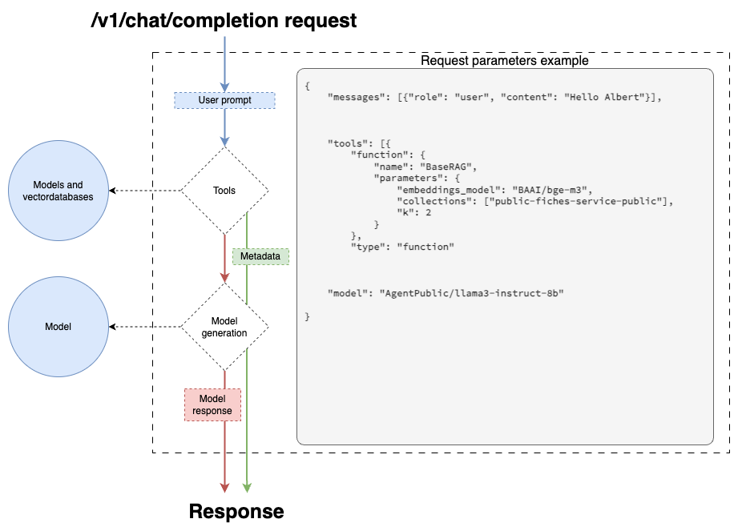

# Albert API

## Fonctionnalités

### OpenAI conventions

En ce base sur le [client officiel python d'OpenAI](https://github.com/openai/openai-python/tree/main), Albert API expose des endpoints respectant les conventions définies par OpenAI : 

- `/v1/models`
- `/v1/completions`
- `/v1/chat/completions`
- `/v1/embeddings`

Ce formalisme permet d'intégrer facilement l'API Albert avec des librairies tierces comme [Langchain](https://www.langchain.com/) ou [LlamaIndex](https://www.llamaindex.ai/).

### Converser avec un modèle de langage (chat memory) 

Albert API intègre nativement la mémorisation des messages pour les conversations sans surcharger d'arguments le endpoint `/v1/chat/completions` par rapport à la documentation d'OpenAI. Cela consiste à envoyer à chaque requête au modèle l'historique de la conversation pour lui fournir le contexte.

### Accéder à plusieurs modèles de langage (multi models)

Grâce à un fichier de configuration (*[config.example.yml](./config.example.yml)*) vous pouvez connecter autant d'API de modèles que vous le souhaitez. L'API Albert se charge de mutualiser l'accès à tous ces modèles dans une unique API. Vous pouvez constater les différents modèles accessibles en appelant le endpoint `/v1/models`.

### Fonctionnalités avancées (tools) 

Les tools sont une fonctionnalité définie OpenAI que l'on surcharge dans le cas de l'API Albert pour permettre de configurer des tâches spéficiques comme du RAG ou le résumé. Vous pouvez appelez le endpoint `/tools` pour voir la liste des tools disponibles.

#### Interroger des documents (RAG)

#### Résumer un document (summarize)

