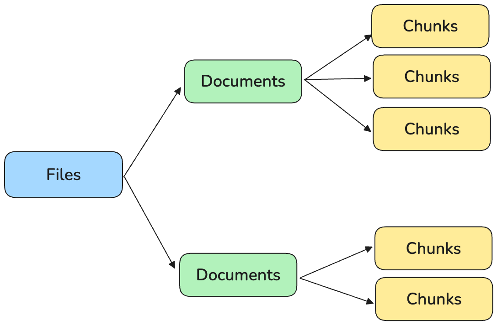
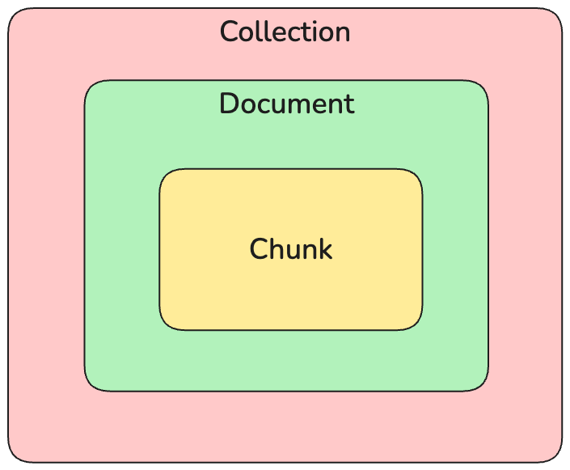
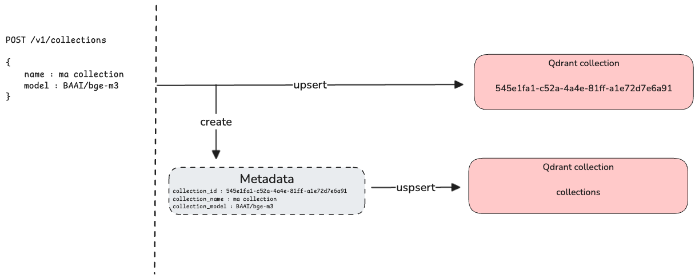
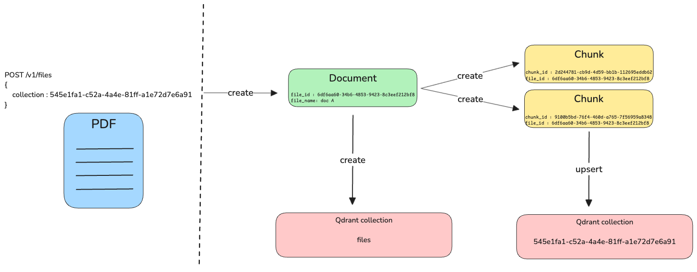

# Search

OpenGateLLM propose d'interagir avec une base de données vectorielle (*vector store*) pour permettre de réaliser du [RAG](https://en.wikipedia.org/wiki/Retrieval-augmented_generation). L'API propose de nourrir ce vector store en important des fichiers qui seront automatiquement traités et insérés dans le *vector store*.

Les collections sont les espaces de stockage dans ce *vector store*. Elles sont utilisées pour organiser les fichiers qui sont importés par l'API. Ces fichiers sont convertis en documents, contenant le texte extrait. Ces documents sont alors découpés en chunks et convertis en vecteurs à l'aide d'un modèle d'embeddings. Ces vecteurs ainsi que le texte qui a été vectorisé sont enregistrés dans la base de données vectorielle.

L'intégration se déroule donc en 3 phases :
- **File** : fichier original (non stocké)
- **Document** : texte extrait d'un fichier
- **Chunk** : portion de texte découpée dans un document

<p align="center">
  
</p>

Une fois importés, vous pouvez interroger l'API pour récupérer les documents ou chunks qui vous intéressent en suivant la hiérarchie suivante reposant sur les 3 entités :
- **Collection** : espace de stockage des documents et chunks
- **Document** : portion de texte découpée dans un fichier
- **Chunk** : portion de texte découpée dans un document

<p align="center">
  
</p>

## Création d'une collection

Avant d'importer un fichier, il convient préalablement de créer une collection à l'aide du endpoint `POST /v1/collections`. Ce endpoint va réaliser 3 opérations successivement :

1. Créer un ID unique (*collection_id*). 
2. Créer une collection qui a pour nom l'ID.
3. Créer une entrée dans la collection nommée *collections* qui enregistre les métadonnées des autres collections. Ces métadonnées sont le nom de la collection, le nombre de fichiers dans la collection ainsi que le modèle d'embeddings associé à la collection. Cette entrée a le même ID que l'ID de la collection.



Vous pouvez consulter vos collections à l'aide du endpoint `GET /v1/collections`.

**Pourquoi enregistrer le nom d'un modèle d'embeddings pour chaque collection ?**

Il est important de comprendre que chaque collection est associée à un modèle d'embeddings car cela va conditionner la recherche de similarité entre plusieurs collections. En effet, comme le modèle d'embeddings définit un espace vectoriel qui lui est propre, il serait incohérent de faire une recherche de similarité entre des vecteurs qui n'ont pas été créés par le même modèle d'embeddings.

Ainsi, la conception de l'API rend impossible de faire une recherche de similarité sur des fichiers qui sont stockés dans deux collections associées à des modèles d'embeddings différents. De plus, en définissant dès la création de la collection un modèle d'embeddings associé, cela rend impossible d'avoir des fichiers vectorisés avec des modèles différents au sein de la même collection.

## Importer un fichier

Une fois la collection créée, vous pouvez importer des fichiers dans l'API avec l'endpoint `POST /v1/files`. Plusieurs types de fichiers sont acceptés par l'API dont JSON, PDF, Markdown ou encore HTML. Le endpoint va réaliser les étapes suivantes :

1. Détecter le type du fichier s'il n'est pas spécifié par l'utilisateur.
2. Créer un ID unique (*document_id*).
3. Créer une entrée dans une collection nommée *documents* qui va stocker les métadonnées du document. Cette entrée a le même ID que l'ID du document.
4. Lancer la pipeline de traitement : 
   1. *parsing* : extraction du texte dans le fichier (conversion en *document*)
   2. *chunking* : découpage du fichier en paragraphes (conversion en *chunks*)
   3. *vectorization* : création d'un vecteur par *chunk*
   4. *indexation* : insertion des *chunks* et de leurs vecteurs dans le *vector store*



Vous pouvez consulter les documents importés dans une collection à l'aide du endpoint `GET /v1/documents/{collection}` en spécifiant l'ID de la collection. De même, vous pouvez consulter les *chunks* d'un document à l'aide du endpoint `GET /v1/chunks/{collection}/{document}` en spécifiant l'ID du document.

**Cas spécifique des JSON**

Le format JSON est adapté pour importer massivement de la donnée via OpenGateLLM. En effet, contrairement aux autres types de fichiers, le JSON va être décomposé par l'API en plusieurs documents, chacun de ces documents sera alors converti en chunks. Ce JSON doit respecter une structure définie.


### Métadonnées

Le fichier JSON doit être structuré comme une liste de documents :

```json
[{"text": "hello world", "title": "my document"}, ...]
```

Il est possible d'ajouter des métadonnées à chaque document importé sous le format JSON. Ces métadonnées sont optionnelles et ne sont pour le moment disponibles que pour les fichiers JSON.

Pour ce faire, vous pouvez les spécifiez comme ceci : 
```json
[{"text": "hello world", "title": "my document", "metadata": {"autor": "me"}}, ...]}
```

Ces métadonnées seront retournées avec le chunk associé au document lors d'une recherche avec l'endpoint `POST /search`.

### Chunking

Pour la stratégie de chunking est configurable en paramètre du endpoint `POST /v1/files`. Différentes chunker sont disponibles :

- `NoSplitter` : le fichier est considéré comme un seul chunk
- `LangchainRecursiveCharacterTextSplitter` : voir [la documentation Langchain](https://python.langchain.com/v0.1/docs/modules/data_connection/document_transformers/recursive_text_splitter/) pour plus de détails

Les paramètres du chunker (taille, séparateur, etc.) sont passés en paramètre du endpoint `POST /v1/files` dans le paramètre `chunker_args`, voir [la documentation](https://albert.api.etalab.gouv.fr/documentation#tag/Retrieval-Augmented-Generation/operation/upload_file_v1_files_post).
