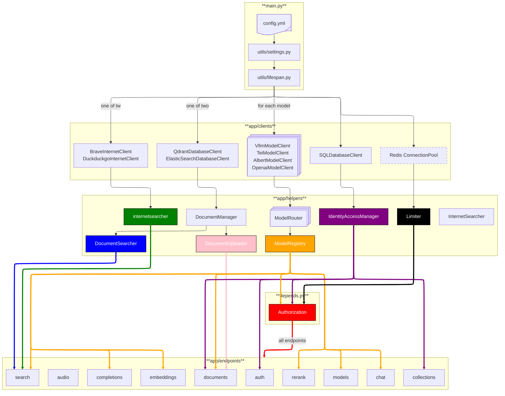

# Code architecture

```mermaid  
---
config:
  layout: elk
  elk:
    mergeEdges: true

---
flowchart TD
    config@{ shape: tag-doc, label: "config.yml" }
    
    subgraph **main.py**
    settings[utils/settings.py]
    lifespan[utils/lifespan.py]

    config --> settings
    settings --> lifespan
    end

    subgraph **app/clients**
    redisclient[Redis ConnectionPool]
    sqlclient[SQLDatabaseClient]
    searchclient[QdrantDatabaseClient<br>ElasticSearchDatabaseClient]
    internetclient[BraveInternetClient<br>DuckduckgoInternetClient]
    modelclient@{ shape: processes, label: "VllmModelClient<br>TeiModelClient<br>AlbertModelClient<br>OpenaiModelClient" }
    
    lifespan --> redisclient
    lifespan --> sqlclient
    lifespan -- one of two --> searchclient
    lifespan -- one of two--> internetclient
    lifespan -- for each model --> modelclient

    style redisclient stroke-dasharray: 5 5
    end
    
    subgraph **app/helpers**
    iternetsearcher[InternetSearcher]
    documentsearcher[DocumentSearcher]
    modelrouter@{ shape: processes, label: "ModelRouter" }
    modelregistry[ModelRegistry]
    identityaccessmanager[IdentityAccessManager]
    documentmanager[DocumentManager]
    documentuploader[DocumentUploader]
    limiter[Limiter]

    internetclient --> internetsearcher
    modelclient --> modelrouter
    modelrouter --> modelregistry
    sqlclient --> identityaccessmanager
 
    searchclient --> documentmanager
   
    documentmanager --> documentsearcher
    documentmanager --> documentuploader
    redisclient --> limiter

    style internetsearcher fill:green,stroke:#000,stroke-width:1px,color:#fff
    style documentsearcher fill:blue,stroke:#000,stroke-width:1px,color:#fff
    style documentuploader fill:pink,stroke:#000,stroke-width:1px,color:#fff
    style modelregistry fill:orange,stroke:#000,stroke-width:1px,color:#fff
    style identityaccessmanager fill:purple,stroke:#000,stroke-width:1px,color:#fff
    style limiter fill:black,stroke:#000,stroke-width:1px,color:#fff
    end

    subgraph **app/endpoints**
    documentsendpoints[documents]
    searchendpoints[search]
    modelsendpoints[models]
    chatendpoints[chat]
    audioendpoints[audio]
    completionsendpoint[completions]
    embeddingsendpoints[embeddings]
    rerankendpoints[rerank]
    collectionsendpoints[collections]
    authendpoints[auth]

    documentuploader ==> documentsendpoints

    modelregistry ==> modelsendpoints
    modelregistry ==> chatendpoints
    modelregistry ==> completionsendpoint
    modelregistry ==> embeddingsendpoints
    modelregistry ==> rerankendpoints
    modelregistry ==> searchendpoints
    modelregistry ==> documentsendpoints
 
    internetsearcher ==> searchendpoints
    documentsearcher ==> searchendpoints

    identityaccessmanager ==> authendpoints
    identityaccessmanager ==> collectionsendpoints
    identityaccessmanager ==> documentsendpoints


    linkStyle 15 stroke: pink
    linkStyle 16 stroke: orange
    linkStyle 17 stroke: orange
    linkStyle 18 stroke: orange
    linkStyle 19 stroke: orange
    linkStyle 20 stroke: orange
    linkStyle 21 stroke: orange
    linkStyle 22 stroke: orange
    linkStyle 23 stroke: green
    linkStyle 24 stroke: blue
    linkStyle 25 stroke: purple
    linkStyle 26 stroke: purple
    linkStyle 27 stroke: purple
    end
    
    subgraph **depends.py**
    authorization[Authorization]

    limiter ====> authorization
    identityaccessmanager ===> authorization
    modelregistry ===> authorization

    style authorization fill:red,stroke:#000,stroke-width:1px,color:#fff
    linkStyle 28 stroke: black
    linkStyle 29 stroke: purple
    linkStyle 30 stroke: orange
    end

    authorization ==all endpoints==> **app/endpoints**
    linkStyle 31 stroke: red


```