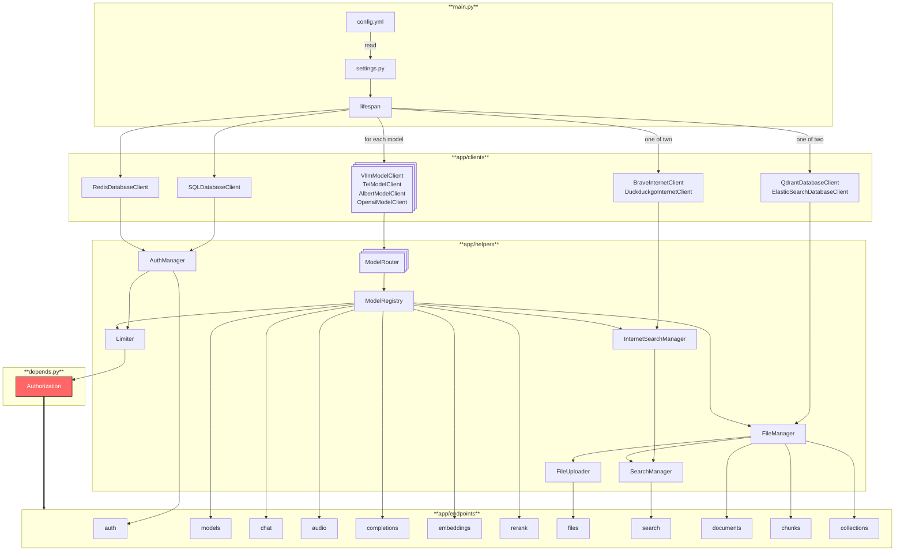

# Code architecture

```mermaid  
flowchart TD
    subgraph **main.py**
    config[config.yml] -->|read| settings[settings.py]
    settings --> lifespan[lifespan]
    end

    subgraph **app/clients**
    lifespan --> redisclient[RedisDatabaseClient]
    lifespan --> sqlclient[SQLDatabaseClient]
    lifespan -->|one of two| searchclient[QdrantDatabaseClient<br>ElasticSearchDatabaseClient]
    lifespan -->|one of two| internetclient[BraveInternetClient<br>DuckduckgoInternetClient]
    lifespan -->|for each model| modelclient@{ shape: processes, label: "VllmModelClient<br>TeiModelClient<br>AlbertModelClient<br>OpenaiModelClient" }
    end
    
    subgraph **app/helpers**
    internetclient --> internetsearchmanager[InternetSearchManager]
    internetsearchmanager --> searchmanager[SearchManager]
    authmanager --> limiter[Limiter]
    modelclient --> modelrouter@{ shape: processes, label: "ModelRouter" }
    modelrouter --> modelregistry[ModelRegistry]
    sqlclient --> authmanager[AuthManager]
    redisclient --> authmanager
 
    searchclient --> filemanager[FileManager]
    filemanager --> fileuploader[FileUploader]
    filemanager --> searchmanager

    modelregistry --> limiter
    modelregistry ----> filemanager
    modelregistry --> internetsearchmanager
    end

    subgraph **app/endpoints**
    authmanager --> authendpoints[auth]

    modelregistry --> modelsendpoints[models]
    modelregistry --> chatendpoints[chat]
    modelregistry --> audioendpoints[audio]
    modelregistry --> completionsendpoint[completions]
    modelregistry --> embeddingsendpoints[embeddings]
    modelregistry --> rerankendpoints[rerank]

    fileuploader --> filesendpoints[files]
    searchmanager --> searchendpoints[search]
    filemanager --> documentsendpoints[documents]
    filemanager --> chunksendpoints[chunks]
    filemanager --> collectionsendpoints[collections]
    end

    subgraph **depends.py**
    style ratelimit fill:#f66,stroke:#000,stroke-width:1px,color:#fff
    limiter --> ratelimit[Authorization]
    end

    ratelimit ===> **app/endpoints**
```