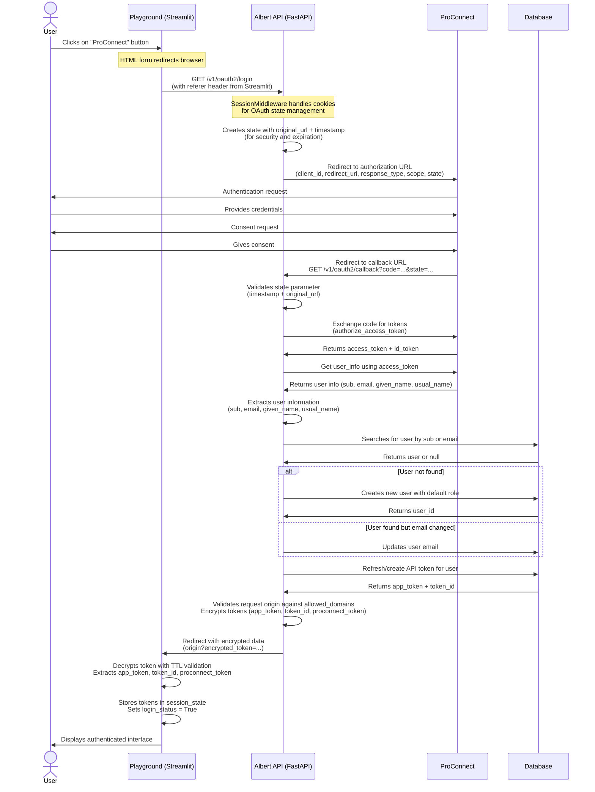

# Albert API ProConnect

## Proconnect Integration

Add a ProConnect connection button on login page. The button is implemented as an HTML form that directly redirects to Albert API's OAuth2 endpoint.

Generate a Albert API key on ProConnect successful authentication callback as follows:



## Key points 

### Implementation Details

* **Button Implementation**: Uses HTML form with direct POST to Albert API (not st.login component). This leverages browser navigation for OAuth flow.
* **Session Management**: FastAPI SessionMiddleware handles cookies and state management during OAuth flow (provides security against CSRF and manages temporary state).
* **Token Security**: Uses our own encrypted tokens instead of directly using ProConnect tokens. This provides better control and security.
* **Logout Implementation**: ✅ Implemented with `/v1/oauth2/logout` endpoint that handles both local token invalidation and ProConnect logout.

### User Information Processing

Reliable [USERINFO](https://partenaires.proconnect.gouv.fr/docs/ressources/glossaire) fields used:
```json
{
  "sub": "704e024229015d2bd47f7a5e5ab05b35c8336ab403c38022985f8cfadc86fe91",  // Primary identifier
  "email": "test@abcd.com",          // Secondary identifier 
  "given_name": "Angela Claire Louise", // User display name
  "usual_name": "DUBOIS"             // User surname
}
```

### Security & Configuration

* **Default Role Assignment**: Creates users with `configuration.dependencies.proconnect.default_role` (configurable in config.yml)
* **Domain Validation**: Strict validation against `allowed_domains` configuration prevents unauthorized redirects
* **Multi-Application Support**: ✅ Multiple applications can use the same Albert API OAuth callback (controlled by `allowed_domains`)
* **Token Encryption**: ✅ API keys are encrypted in redirect URLs using time-limited encryption (5-minute TTL) with shared secret
* **State Validation**: OAuth state includes timestamp validation (10-minute window) to prevent replay attacks