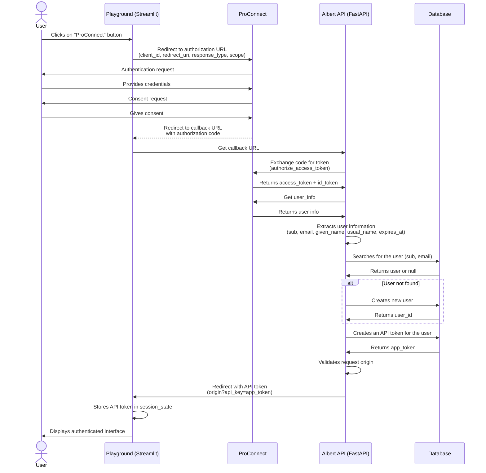

# Albert API ProConnect

## Current Implementation

* UI Streamlit with it's own database for login / password authentication
* Backend FastAPI with authentication with API keys

## Proconnect Integration

Add a ProConnect connection button using st.login component (compatible with OAuth) on login page.

Generate a Albert API key on ProConnect successful authent call back as fallow :



## Key points 

* Is st.login OK ? (based on Python Authlib)
* Is it OK to not use ProConnect Token and use our own token instead ?
* Is it mandatory to implement logout functionnality ?
*  Which [USERINFO](https://partenaires.proconnect.gouv.fr/docs/ressources/glossaire) are reliable ? :
```json
{
  "sub": "704e024229015d2bd47f7a5e5ab05b35c8336ab403c38022985f8cfadc86fe91",
  "uid": "1",
  "given_name": "Angela Claire Louise",
  "usual_name": "DUBOIS",
  "email": "test@abcd.com",
  "siren": "343293775",
  "siret": "34329377500037",
  "organizational_unit": "comptabilite",
  "belonging_population": "agent",
  "phone_number": "+331-12-44-45-23",
  "chorusdt:matricule": "USER_AGC",
  "chorusdt:societe": "CHT",
  "idp_id": "fia1v2",
  "idp_acr": "eidas1",
  "aud": "6925fb8143c76eded44d32b40c0cb1006065f7f003de52712b78985704f39950",
  "exp": 1668779720,
  "iat": 1668779660,
  "iss": "https://fca.integ01.dev-agentconnect.fr/api/v2"
}
```

* Do we create a default role (and associated limits) for a Proconnect user or do we create / associate a role base on USERINFO [when we create a user](../app/endpoints/oauth2.py#L49) ?
* In current POC, you can plugs several applications ([you can authorize different origins](../app/endpoints/oauth2.py#L66) to use Albert API call back URL). Is it a good pattern ?
* Is OK to add API key in [redirection URL](../app/endpoints/oauth2.py#L70) ?