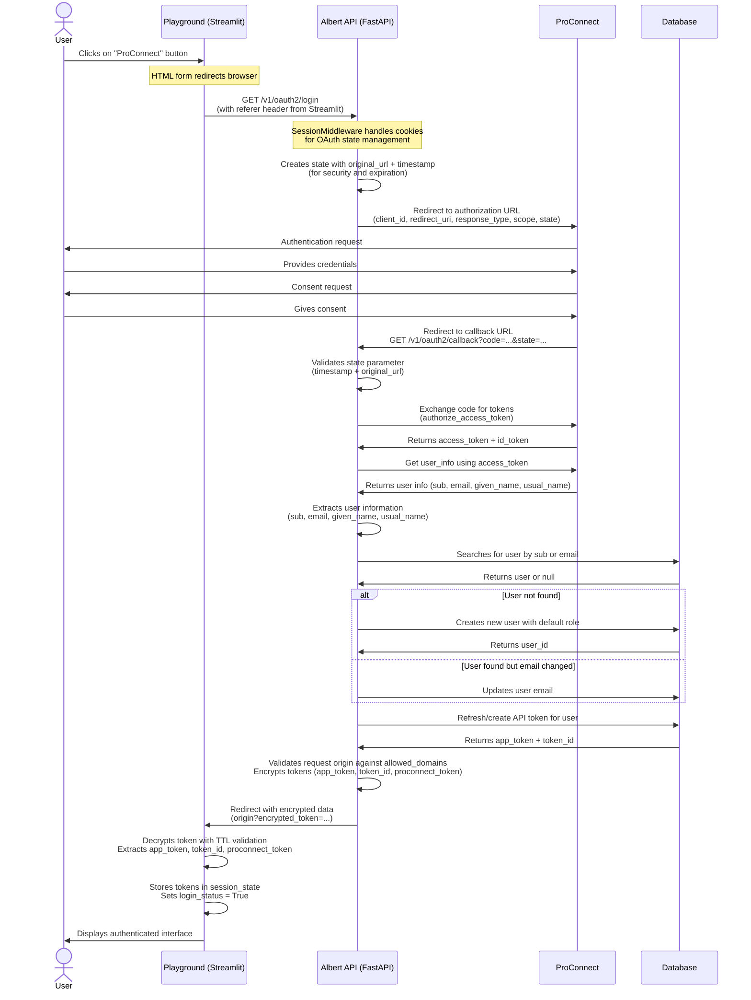

# Albert API ProConnect

> 📁 **Code References**: This documentation includes direct links to implementation files in the GitHub repository. Click on the links to navigate to the specific code sections.

## Proconnect Integration

Add a ProConnect connection button on login page. The button is implemented as an HTML form that directly redirects to Albert API's OAuth2 endpoint.

Generate a Albert API key on ProConnect successful authentication callback as follows:



**Code References for Sequence Diagram:**
- **ProConnect Button**: [`ui/frontend/proconnect.py`](../ui/frontend/proconnect.py#L27-L48)
- **SessionMiddleware**: [`app/factory.py#L67`](../app/factory.py#L67)
- **OAuth Login**: [`app/endpoints/proconnect/__init__.py#L78-L96`](../app/endpoints/proconnect/__init__.py#L78-L96)
- **OAuth Callback**: [`app/endpoints/proconnect/__init__.py#L149-L200`](../app/endpoints/proconnect/__init__.py#L149-L200)
- **Token Encryption**: [`app/endpoints/proconnect/encryption.py`](../app/endpoints/proconnect/encryption.py)
- **Token Decryption**: [`ui/backend/login.py#L80-L102`](../ui/backend/login.py#L80-L102)
- **User Processing**: [`app/endpoints/proconnect/user.py`](../app/endpoints/proconnect/user.py)

## Key points 

### Implementation Details

* **Button Implementation**: Uses HTML form with direct POST to Albert API (not st.login component). This leverages browser navigation for OAuth flow. 
  - [`ui/frontend/proconnect.py`](../ui/frontend/proconnect.py#L27-L48) - ProConnect button HTML/CSS
  - [`ui/frontend/header.py`](../ui/frontend/header.py#L27-L36) - Button integration in login form
  
* **Session Management**: FastAPI SessionMiddleware handles cookies and state management during OAuth flow (provides security against CSRF and manages temporary state).
  - [`app/factory.py#L67`](../app/factory.py#L67) - SessionMiddleware configuration
  
* **Token Security**: Uses our own encrypted tokens instead of directly using ProConnect tokens. This provides better control and security.
  - [`app/endpoints/proconnect/encryption.py`](../app/endpoints/proconnect/encryption.py) - Token encryption/decryption
  - [`ui/backend/login.py#L80-L102`](../ui/backend/login.py#L80-L102) - Frontend token decryption
  
* **Logout Implementation**: ✅ Implemented with `/v1/oauth2/logout` endpoint that handles both local token invalidation and ProConnect logout.
  - [`app/endpoints/proconnect/__init__.py#L207-L268`](../app/endpoints/proconnect/__init__.py#L207-L268) - Logout endpoint
  - [`app/endpoints/proconnect/token.py#L89-L130`](../app/endpoints/proconnect/token.py#L89-L130) - ProConnect logout handling
  - [`ui/backend/login.py#L252-L276`](../ui/backend/login.py#L252-L276) - Frontend logout call

### User Information Processing

Reliable [USERINFO](https://partenaires.proconnect.gouv.fr/docs/ressources/glossaire) fields used:
```json
{
  "sub": "704e024229015d2bd47f7a5e5ab05b35c8336ab403c38022985f8cfadc86fe91",  // Primary identifier
  "email": "test@abcd.com",          // Secondary identifier 
  "given_name": "Angela Claire Louise", // User display name
  "usual_name": "DUBOIS"             // User surname
}
```

### Security & Configuration

* **Default Role Assignment**: Creates users with `configuration.dependencies.proconnect.default_role` (configurable in config.yml)
* **Domain Validation**: Strict validation against `allowed_domains` configuration prevents unauthorized redirects
* **Multi-Application Support**: ✅ Multiple applications can use the same Albert API OAuth callback (controlled by `allowed_domains`)
* **Token Encryption**: ✅ API keys are encrypted in redirect URLs using time-limited encryption (5-minute TTL) with shared secret
* **State Validation**: OAuth state includes timestamp validation (10-minute window) to prevent replay attacks

## Configuration

### Backend (Albert API) Configuration

Add the following to your `config.yml`:
- [`config.example.yml`](../config.example.yml) - Example configuration
- [`app/schemas/core/configuration.py`](../app/schemas/core/configuration.py) - Configuration schema

```yaml
dependencies:
  proconnect:
    client_id: "your_proconnect_client_id"
    client_secret: "your_proconnect_client_secret"
    server_metadata_url: "https://identite-sandbox.proconnect.gouv.fr/.well-known/openid-configuration"
    redirect_uri: "https://your-domain.gouv.fr/v1/oauth2/callback"
    scope: "openid profile email"
    allowed_domains: "localhost,gouv.fr"  # Comma-separated list
    default_role: "Freemium"  # Role assigned to new ProConnect users
    encryption_key: "YOUR_GENERATED_KEY_HERE"  # Generate with: python -c "from cryptography.fernet import Fernet; print(Fernet.generate_key().decode())"

settings:
  session_secret_key: "your-session-secret-key"  # For SessionMiddleware
```

### Frontend (Streamlit UI) Configuration

Add the following to your UI `config.yml`:
- [`ui/configuration.py`](../ui/configuration.py) - UI configuration schema

```yaml
playground:
  api_url: "http://localhost:8000"  # Albert API base URL
  oauth2_encryption_key: "YOUR_GENERATED_KEY_HERE"  # Same key as backend
  proconnect_enabled: true
```

## API Endpoints

### `/v1/oauth2/login` (GET)

Initiates the OAuth2 login flow with ProConnect.
[📁 `app/endpoints/proconnect/__init__.py#L78-L96`](../app/endpoints/proconnect/__init__.py#L78-L96)

**Parameters:**
- `origin` (query, optional): Return URL after successful authentication

**Response:** Redirect to ProConnect authorization URL

**Example:**
```bash
curl -X GET "https://api.albert.gouv.fr/v1/oauth2/login" \
  -H "Referer: https://playground.albert.gouv.fr"
```

### `/v1/oauth2/callback` (GET)

Handles OAuth2 callback from ProConnect.
[📁 `app/endpoints/proconnect/__init__.py#L149-L200`](../app/endpoints/proconnect/__init__.py#L149-L200)

**Parameters:**
- `code` (query): Authorization code from ProConnect
- `state` (query): State parameter with original URL and timestamp

**Response:** Redirect to origin with encrypted token

**Automatic Processing:**
1. Validates state parameter and timestamp
2. Exchanges authorization code for tokens
3. Retrieves user information from ProConnect
4. Creates or updates user in database
5. Generates Albert API token
6. Encrypts tokens and redirects to origin

### `/v1/oauth2/logout` (POST)

Logs out user from both Albert API and ProConnect.
[📁 `app/endpoints/proconnect/__init__.py#L207-L268`](../app/endpoints/proconnect/__init__.py#L207-L268)

**Authentication:** Bearer token required

**Request Body:**
```json
{
  "proconnect_token": "optional_proconnect_id_token"
}
```

**Response:**
```json
{
  "status": "success",
  "message": "Successfully logged out from ProConnect and expired token"
}
```

**Example:**
```bash
curl -X POST "https://api.albert.gouv.fr/v1/oauth2/logout" \
  -H "Authorization: Bearer your_api_token" \
  -H "Content-Type: application/json" \
  -d '{"proconnect_token": "your_proconnect_id_token"}'
```

### `/v1/oauth2/playground-login` (GET)

Internal endpoint for Streamlit UI to refresh API tokens.
[📁 `app/endpoints/proconnect/__init__.py#L99-L142`](../app/endpoints/proconnect/__init__.py#L99-L142)

**Parameters:**
- `encrypted_token` (query): Encrypted user ID token

**Response:**
```json
{
  "status": "success",
  "api_key": "refreshed_api_token",
  "token_id": 123,
  "user_id": 456
}
```

## Error Handling

### Common Error Scenarios

| Error | Status | Description | Solution |
|-------|--------|-------------|----------|
| Invalid domain | 400 | Request domain not in `allowed_domains` | Add domain to configuration |
| Expired state | 400 | OAuth flow took longer than 10 minutes | Restart login process |
| Missing user info | 400 | ProConnect didn't return required `sub` field | Check ProConnect configuration |
| Token decryption failed | 400 | Invalid or expired encrypted token | User needs to re-authenticate |
| ProConnect unavailable | 500 | External service error | Check ProConnect status |

### Example Error Response

```json
{
  "detail": "Invalid domain: example.com not in allowed domains or their subdomains"
}
```

## Security Considerations

### Token Encryption

- **Encryption Key**: Must be identical between backend and frontend
- **TTL**: Encrypted tokens expire after 5 minutes
- **Rotation**: Regularly rotate encryption keys in production
- **Algorithm**: Uses Fernet (AES 128 in CBC mode with HMAC for authentication)

### Domain Validation

```yaml
allowed_domains: "localhost,albert.gouv.fr,playground.gouv.fr"
```
[📁 `app/endpoints/proconnect/__init__.py#L53-L67`](../app/endpoints/proconnect/__init__.py#L53-L67) - Domain validation logic

- Supports exact domain matching
- Supports subdomain matching (e.g., `*.gouv.fr`)
- Prevents open redirect vulnerabilities

### State Parameter Security

- [📁 `app/endpoints/proconnect/__init__.py#L85-L87`](../app/endpoints/proconnect/__init__.py#L85-L87) - State creation
- [📁 `app/endpoints/proconnect/__init__.py#L152-L165`](../app/endpoints/proconnect/__init__.py#L152-L165) - State validation

- Includes timestamp to prevent replay attacks
- Contains original URL for proper redirection
- Base64 encoded JSON structure
- 10-minute expiration window

## User Management

### User Creation Flow

- [📁 `app/endpoints/proconnect/user.py`](../app/endpoints/proconnect/user.py) - User creation logic
- [📁 `app/endpoints/proconnect/__init__.py#L181-L192`](../app/endpoints/proconnect/__init__.py#L181-L192) - User lookup and update

1. **First Login**: User authenticated via ProConnect
2. **Lookup**: Search by `sub` (primary) or `email` (secondary)
3. **Creation**: If not found, create with `default_role`
4. **Update**: If email changed, update user record
5. **Token**: Generate/refresh playground token

### User Attributes Mapping

| ProConnect Field | Albert API Field | Usage |
|------------------|------------------|-------|
| `sub` | `sub` | Primary unique identifier |
| `email` | `email` | Secondary identifier, can be updated |
| `given_name` | Display purposes | User's first name |
| `usual_name` | Display purposes | User's last name |
| `id_token` | `proconnect_token` | Stored for logout functionality |

### Role Assignment

- New users receive `configuration.dependencies.proconnect.default_role`
- Roles define permissions and usage limits
- Can be updated manually by administrators after creation

## Deployment

### Production Checklist

- [ ] **Environment Variables**: Use environment variables for sensitive configuration
- [ ] **HTTPS**: Ensure all URLs use HTTPS in production
- [ ] **ProConnect Registration**: Register your application with ProConnect
- [ ] **Domain Configuration**: Update `allowed_domains` for production domains
- [ ] **Key Management**: Use secure key generation and rotation practices
- [ ] **Monitoring**: Set up logging for OAuth flows and errors
- [ ] **Backup**: Ensure encryption keys are backed up securely

### Environment Variables

```bash
# Albert API
PROCONNECT_CLIENT_ID=your_client_id
PROCONNECT_CLIENT_SECRET=your_client_secret
PROCONNECT_ENCRYPTION_KEY=your_encryption_key
SESSION_SECRET_KEY=your_session_secret

# Streamlit UI
OAUTH2_ENCRYPTION_KEY=your_encryption_key  # Same as backend
```

### Docker Configuration

Ensure your Docker setup includes the SessionMiddleware configuration:
[📁 `app/factory.py#L67`](../app/factory.py#L67) - SessionMiddleware setup

```python
# app/factory.py
app.add_middleware(SessionMiddleware, secret_key=configuration.settings.session_secret_key)
```

## Troubleshooting

### Common Issues

1. **"Invalid domain" Error**
   - Check `allowed_domains` configuration
   - Verify domain matches exactly (including subdomains)

2. **"OAuth2 request has expired"**
   - User took longer than 10 minutes to complete OAuth flow
   - Restart the authentication process

3. **Token Decryption Failed**
   - Verify encryption keys match between backend and frontend
   - Check if token has expired (5-minute TTL)

4. **ProConnect Logout Fails**
   - ProConnect service may be unavailable
   - Local logout still succeeds, only ProConnect logout fails

### Debugging

Enable debug logging in your configuration:

```yaml
settings:
  log_level: "DEBUG"
```

Check logs for OAuth flow details:
- State parameter validation
- Token exchange with ProConnect
- User creation/update operations
- Encryption/decryption operations