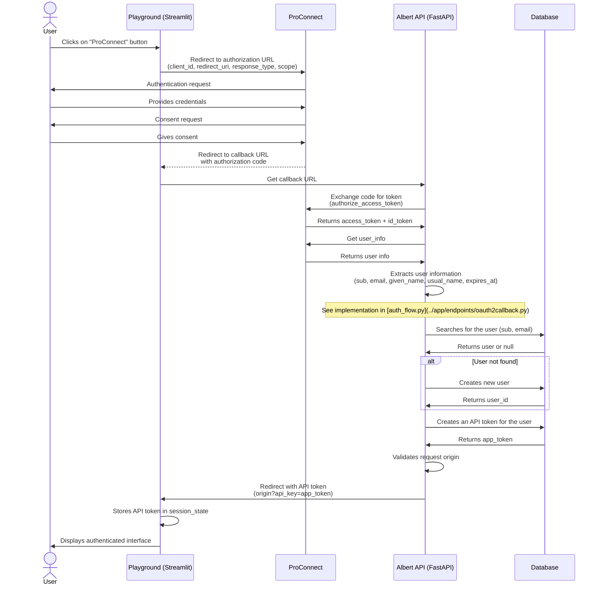

```mermaid
sequenceDiagram
    actor User
    participant StreamLit as Playground (Streamlit)
    participant ProConnect as ProConnect
    participant FastAPI as Albert API (FastAPI)
    participant Database as Database
    
    User->>StreamLit: Clicks on "ProConnect" button
    StreamLit->>ProConnect: Redirect to authorization URL<br>(client_id, redirect_uri, response_type, scope)
    
    ProConnect->>User: Authentication request
    User->>ProConnect: Provides credentials
    ProConnect->>User: Consent request
    User->>ProConnect: Gives consent
   
    ProConnect-->>StreamLit: Redirect to callback URL<br>with authorization code
    StreamLit->>FastAPI: Get callback URL
    
    FastAPI->>ProConnect: Exchange code for token<br>(authorize_access_token)
    ProConnect->>FastAPI: Returns access_token + id_token

    FastAPI->>ProConnect: Get user_info
    ProConnect->>FastAPI: Returns user info

    
    FastAPI->>FastAPI: Extracts user information<br>(sub, email, given_name, usual_name, expires_at)
    Note over FastAPI,FastAPI: See implementation in [auth_flow.py](../app/endpoints/oauth2callback.py)
    
    FastAPI->>Database: Searches for the user (sub, email)
    Database->>FastAPI: Returns user or null
    
    alt User not found
        FastAPI->>Database: Creates new user
        Database->>FastAPI: Returns user_id
    end
    
    FastAPI->>Database: Creates an API token for the user
    Database->>FastAPI: Returns app_token
    
    FastAPI->>FastAPI: Validates request origin
    FastAPI->>StreamLit: Redirect with API token<br>(origin?api_key=app_token)
    
    StreamLit->>StreamLit: Stores API token in session_state
    StreamLit->>User: Displays authenticated interface
```